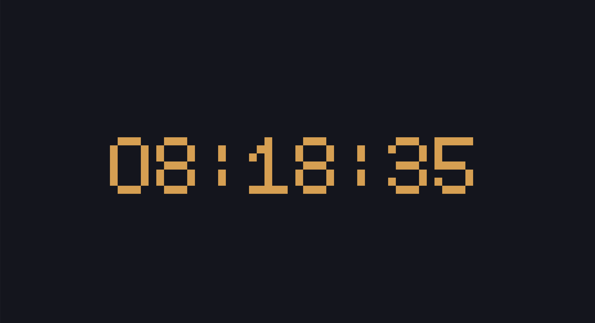
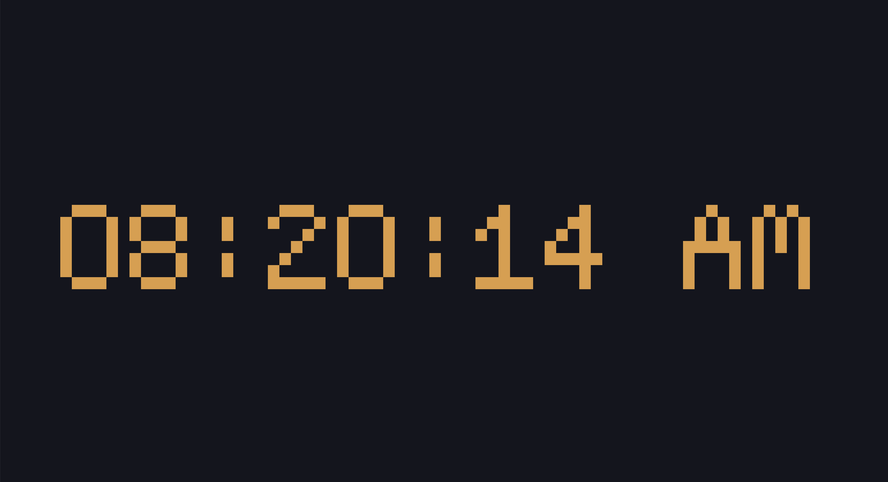
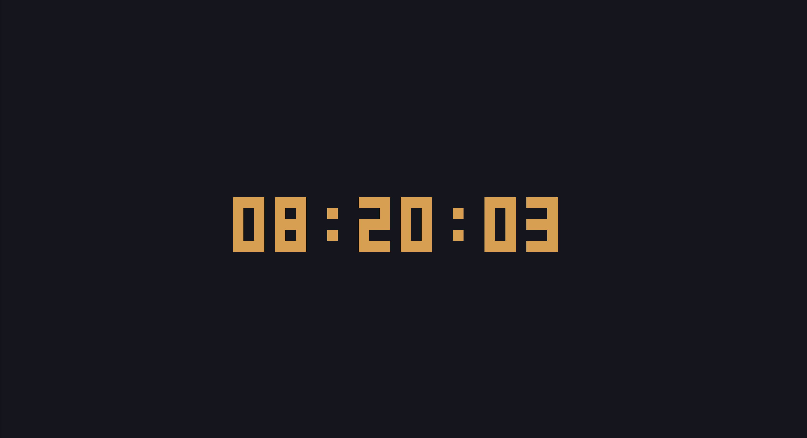
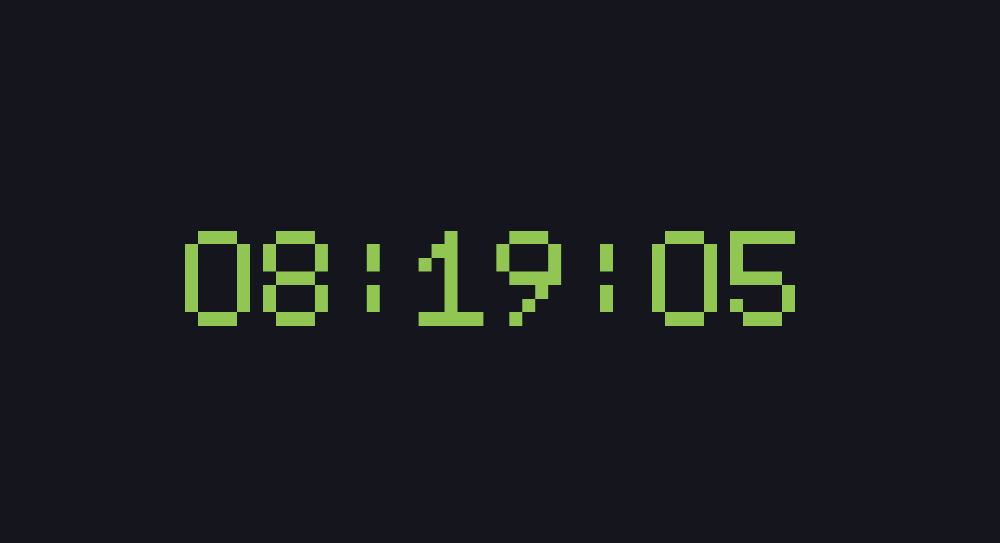
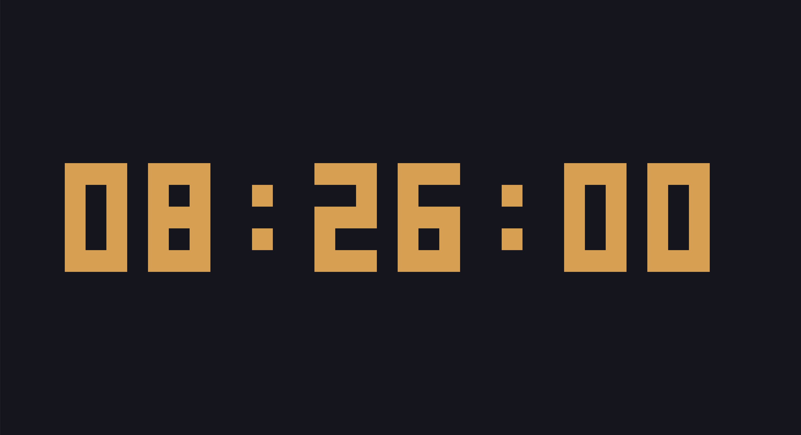
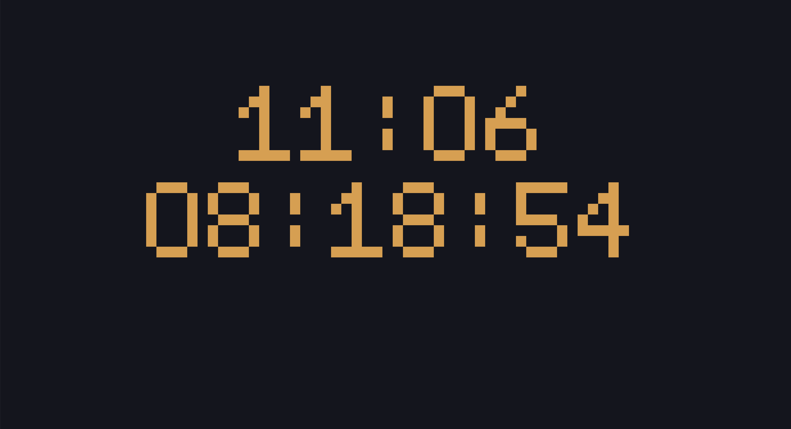

# Rust Clock CLI

[](https://github.com/binghan1227/rust-clock-cli/releases/latest)

A simple, elegant, and highly customizable command-line clock written in Rust.

## Screenshots

| Default | 12-Hour Mode |
| :---: | :---: |
|  |  |

| Font Change | Color Change |
| :---: | :---: |
|  |  |

|Size Change | Countdown |
| :---: | :---: |
|  |  |


## Features

* **Customizable Fonts and Colors**: Choose from multiple built-in fonts and a wide range of colors to personalize your clock's appearance.
* **12-hour and 24-hour formats**: Display the time in either 12-hour or 24-hour format.
* **Adjustable Size and Position**: Control the size and position of the clock on your terminal.
* **Countdown Timer**: Start a countdown for a specific duration or to a target time.
* **Cross-platform**: Works on Windows, macOS, and Linux.

## Installation

### Download pre-built binaries

You can download the latest release for your platform from the [GitHub Releases page](https://github.com/binghan1227/rust-clock-cli/releases/latest).

After downloading, make sure to give execute permissions (on macOS/Linux):

```bash
chmod +x rust-clock-cli-*
```

### From source

1.  **Clone the repository:**
    ```bash
    git clone https://github.com/binghan1227/rust-clock-cli.git
    cd rust-clock-cli
    ```

2.  **Build the project:**
    ```bash
    cargo build --release
    ```
    The executable will be located at `target/release/rust-clock-cli`.

## Usage

To start the clock, simply run the executable:

```bash
./rust-clock-cli
```

### Options

| Flag | Description | Default |
| :--- | :--- | :--- |
| `-H`, `--height` | Height of each digit tile. | `1` |
| `-W`, `--width` | Width of each digit tile. | `2` |
| `-x` | Horizontal offset (x position). | `0` |
| `-y` | Vertical offset (y position). | `0` |
| `--12` | Use 12-hour clock format. | `false` |
| `-f`, `--font` | Font style for digits (0: 5x7, 1: 3x5). | `0` |
| `-c`, `--color` | Color of the digit tiles. | `3` |

### Countdown Timer

You can also use the `countdown` subcommand to start a timer.

#### Countdown for a duration:

```bash
./rust-clock-cli countdown -d 10m
```

This will start a 10-minute countdown. You can use `h`, `m`, and `s` for hours, minutes, and seconds, respectively.

#### Countdown to a specific time:

```bash
./rust-clock-cli countdown -t "2025-12-31 23:59:59"
```

This will start a countdown to the specified date and time.

## Acknowledgments

This project was inspired by and borrows some code from [nwtnni/tock](https://github.com/nwtnni/tock). A big thank you to the original author for their work.
